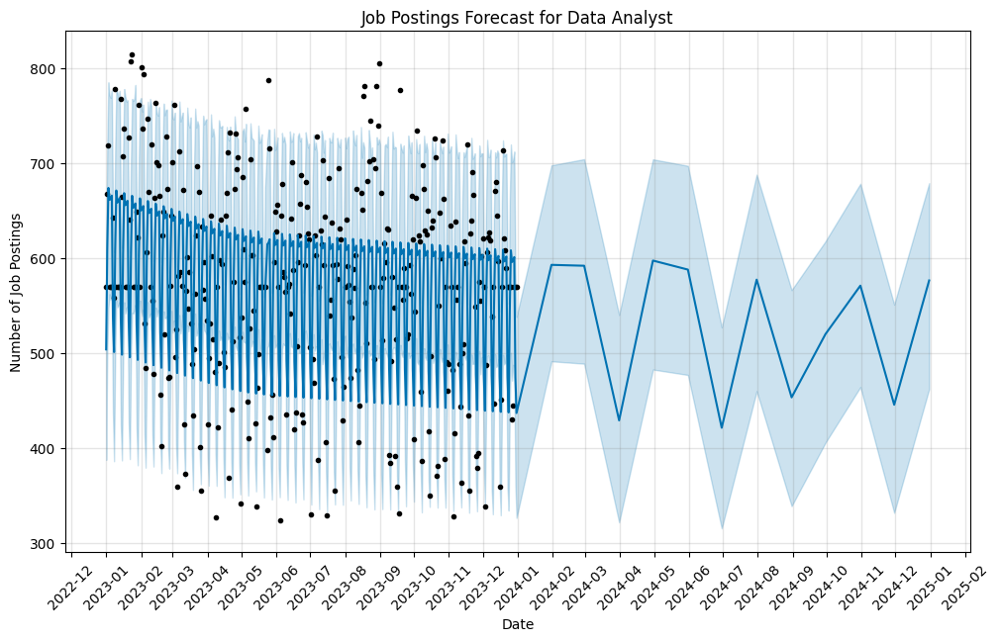

# Data Science Job Market Analysis

## Project Overview
This project analyzes the data science job market using a dataset of job postings. The analysis includes exploratory data analysis (EDA) and time series forecasting to understand current trends and predict future job postings.

## Table of Contents
1. [Data Preparation](#data-preparation)
2. [Exploratory Data Analysis](#exploratory-data-analysis)
3. [Time Series Forecasting](#time-series-forecasting)
4. [Key Findings](#key-findings)
5. [Installation and Usage](#installation-and-usage)

## Data Preparation
The project uses a cleaned dataset (`df_cleaned.csv`) containing information about data science job postings. The data includes features such as job titles, posting dates, locations, and the number of jobs.

## Exploratory Data Analysis
The EDA phase includes various visualizations and analyses:

### Distribution of Job Titles


This bar plot shows the distribution of Data job types in our dataset, giving us an overview of the most common posted data job.

### Job Titles Word Cloud


This word cloud visualizes the frequency of different job titles, with larger words indicating more frequent occurrences.

### Geographical Distribution of Jobs


This interactive heatmap (HTML file) shows the geographical distribution of job postings, highlighting areas with high concentrations of data science jobs.

### Job Postings Over Time


This time series plot shows the trend of job postings over time, allowing us to identify any seasonal patterns or overall trends in the job market.

### Analysis of Job Skills


This stacked bar chart shows the most in-demand skills across different job titles in the data science field.

### Salary Distributions


This box plot compares salary distributions across different job titles, giving insights into the earning potential of various data science roles.

## Time Series Forecasting
The project uses Facebook's Prophet library for time series forecasting. Here are the forecast plots for different job titles:

### Data Engineer Job Forecast


### Data Analyst Job Forecast


### Data Scientist Job Forecast


### Machine Learning Engineer Job Forecast


### Business Analyst Job Forecast


### Cloud Engineer Job Forecast


### Software Engineer Job Forecast


These forecasts provide insights into the expected trends for each job title over the next few months.

## Key Findings
(Note: This section should be filled with actual insights from your analysis. Here are some placeholder points based on the visualizations:)

1. The most common job titles in the dataset are Data Engineer, Data Analyst, and Data Scientist.
2. There's an increasing trend in job postings over time, with some seasonal fluctuations.
3. Major tech hubs show the highest concentration of data science jobs.
4. The most in-demand skills across all job titles include Python, SQL, and machine learning.
5. Machine Learning Engineers and Data Scientists tend to have higher median salaries compared to other roles.
6. Reliable short-term predictions with good accuracy and excellent long-term forecast precision.

## Installation and Usage

### Prerequisites
- Python 3.x
- pip

## Live Demo
Check out the live version of the app: [Emerging Data Job Opportunities](https://reetusharma1209-data-jobs-app-app-32jadi.streamlit.app/)


### Installation
1. Clone this repository:
   ```
   git clone [repository-url]
   ```
2. Navigate to the project directory:
   ```
   cd data-science-job-market-analysis
   ```
3. Install the required packages:
   ```
   pip install -r requirements.txt
   ```

### Usage
1. Run the EDA script:
   ```
   python eda_script.py
   ```
2. Run the time series forecasting notebook:
   ```
   jupyter notebook prophet.ipynb
   ```

## Contributing
Contributions to this project are welcome. Please fork the repository and submit a pull request with your changes.

## License
This project is licensed under the MIT License - see the LICENSE file for details.
